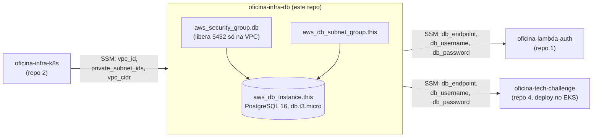

# oficina-infra-db

Terraform: banco de dados gerenciado (**Amazon RDS PostgreSQL**) — repositório 3 de 4
do Tech Challenge Fase 3. Aplique **depois** do `oficina-infra-k8s` (lê a VPC/subnets
que ele publica no SSM Parameter Store) e **antes** do `oficina-lambda-auth` (que lê o
endpoint/credenciais publicados aqui).

## Por que RDS PostgreSQL gerenciado

Mesma justificativa relacional das Fases 1/2 (transações ACID para a baixa de
estoque), mais o motivo específico da Fase 3: backups automáticos, patching e failover
sem operação manual. Alternativas consideradas (Aurora Serverless v2, DynamoDB,
self-hosted no EKS) em `docs/rfc/` no repositório principal.

## ⚠️ Custo

`db.t3.micro` é elegível ao **free tier de 12 meses** em contas AWS novas. Fora do free
tier, gira em torno de US$ 0,017/h + armazenamento (20GB gp3). Rode `terraform destroy`
quando o ambiente não estiver em uso para não manter custo ocioso.

## Diagrama



## Como aplicar

```bash
terraform init
terraform apply
```

## Recursos criados

| Recurso | Descrição |
|---|---|
| `aws_db_subnet_group.this` | Usa as subnets privadas publicadas pelo `oficina-infra-k8s` |
| `aws_security_group.db` | Libera 5432 apenas para o CIDR da VPC (EKS e Lambda) |
| `aws_db_instance.this` | RDS PostgreSQL 16, `db.t3.micro`, não publicamente acessível |
| `random_password.db_password` | Senha mestra gerada aleatoriamente |
| `aws_ssm_parameter.*` | Publica endpoint/credenciais para `oficina-lambda-auth` e o deploy do app principal |

## Modelo de dados

O schema é criado pela própria aplicação (`oficina-tech-challenge`, via
`synchronize`/TypeORM na primeira execução — ver o README de lá). O diagrama ER e a
explicação dos relacionamentos ficam em `docs/database/` no repositório principal.

## Destruir

```bash
terraform destroy
```
